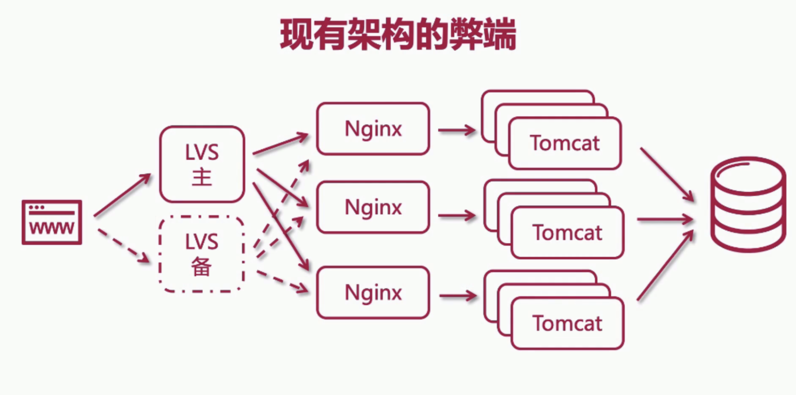
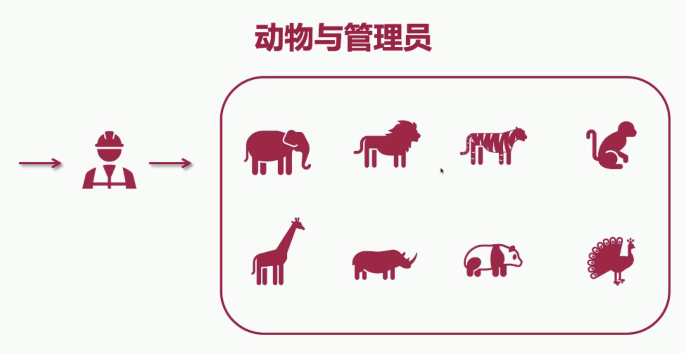
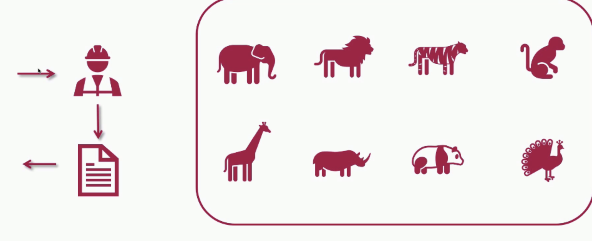

#  第七周 本阶段计划
- 分布式缓存中间件`Redis`
- 分布式会还与单点登录
- 分布式搜索引擎`Elasticsearch`
- 分布式文件系统
- 分布式消息队列
- 分布式锁
- 数据库读写分离与分库分表
- 数据库表全局唯一主键id设计
- 分布式事务和数据一致性
- 接口幂等设计与分布式限流

# 分布式架构概述
## 1、什么是分布式架构
- 不同的业务(功能模块)分散部署到不同的服务器
- 每个子系统负责一个或者多个不同的业务模块
- 服务之间可以相互交互与通信
- 分布式系统设计对用户透明（用户无感知）
- 可以发展为集群分布式系统架构（微服务是分布式架构的一种）

## 2、单体架构的弊端
- 模块之间的耦合度高，其中一个模块更改，其他模块也会更改，效率低，风险大，耗时。

## 3、分布式架构的优势
- 业务解耦
- 系统模块化，可重用化（如文件上传系统，鉴权系统拆分）
- 提升系统并发量
- 优化运维部署效率

## 4、分布式架构的缺点
- 架构复杂
- 部署多个子系统复杂(多服务器，和多子系统)
- 系统之间的通信耗时
- 新人融入团队缓慢(学习成本大)
- 调试复杂（链路多，模块多，不好定位bug）

## 5、设计原则
- 异步解耦(能使用异步，就使用异步 会使用到mq)
- 幂等性一致(多次点击出现多条数据 常见于新增和修改)
- 拆分原则(根据业务拆分、功能拆分)
- 融合分布式中间件(redis缓存、消息队列等)
- 容错高可用

# 现有架构的弊端

如新浪微博的热点事件，上亿的查询流量导致数据库大处理压力，使用`redis`来作为缓存，提高数据库的读取性能。

例子：动物园与管理员
动物有很多动物，当游客询问管理员动物园有多少动物，动物园管理员依次数各类动物多少只，如果许多游客都询问，管理员无法依次去数动物，管理员可以通过类似`账本`的东西预先记录在本子里，管理员将`账本`的数据返回给游客

### 数据更新和维护
管理员会记录动物园的动物出生，和死亡，并同步到`账本`中

# 什么是NoSQL
- Not Only SQL 不仅仅是数据库
- 传统项目使用存数据库
- nosql为互联网和大数据而生

redis是noSQL
## 